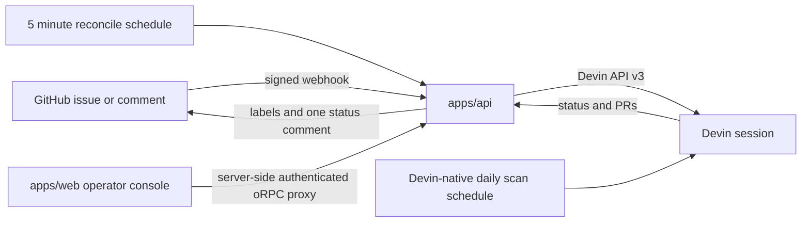

# Devin remediation control plane

An event-driven control plane that remediates GitHub issues with [Devin](https://devin.ai) sessions. It discovers every open issue in the configured repositories, launches and manages Devin API v3 sessions, reflects their state back into GitHub as labels and a single status comment, and provides a Next.js operator console. The reference workspace targets `NickMandylas/superset`.

The project is a pnpm workspace: two Next.js 16 App Router applications and a shared contract-first oRPC v2 package.

## Architecture



| Workspace | Purpose | Port |
| --- | --- | --- |
| `apps/web` | shadcn/ui remediation console and authenticated server-side oRPC proxy | `3000` |
| `apps/api` | oRPC router, Devin client, GitHub webhook, and reconciler | `3001` |
| `packages/contracts` | Shared Zod schemas and oRPC contract | n/a |

The browser calls `/rpc` on the web application. A web Route Handler forwards the request to the API (`API_INTERNAL_URL`) and adds `CONTROL_PLANE_TOKEN` on the server, so the API credential is never included in client JavaScript.

## Quick start with Docker

Prerequisites: Docker with Compose v2. No local Node.js toolchain is needed.

1. Create the environment file and fill in the values (see [Credentials](#credentials)):

   ```bash
   cp .env.example .env
   ```

2. Build and start everything:

   ```bash
   docker compose up --build
   ```

3. Open [http://localhost:3000](http://localhost:3000). The API health endpoint is [http://localhost:3001/api/health](http://localhost:3001/api/health).

The single root `Dockerfile` is multi-stage with two runtime targets (`api` and `web`); Compose builds both services from it. A third `scheduler` service replaces Vercel Cron in Docker: it calls the authenticated `/api/cron/reconcile` endpoint every five minutes. The daily vulnerability scan needs no container cron because it is [scheduled natively in Devin](#daily-dependency-vulnerability-scan).

| Compose service | Image source | Port |
| --- | --- | --- |
| `web` | `Dockerfile` target `web` | `3000` |
| `api` | `Dockerfile` target `api` (healthchecked on `/api/health`) | `3001` |
| `scheduler` | `curlimages/curl` loop | n/a |

### Credentials

| Variable | Purpose |
| --- | --- |
| `DEVIN_API_TOKEN`, `DEVIN_ORG_ID` | Devin API v3 service user with `ManageOrgSessions` and `ViewOrgSessions` |
| `GITHUB_REPOSITORY` | Target repository (`owner/name`) |
| `GITHUB_TOKEN` | Fine-grained token or GitHub App installation token: metadata read, Issues read/write |
| `GITHUB_WEBHOOK_SECRET` | HMAC secret for webhook signature verification |
| `CRON_SECRET` | Bearer token protecting `/api/cron/*` (used by the `scheduler` service) |
| `CONTROL_PLANE_TOKEN` | Shared bearer token between the web proxy and the API |

Generate independent random values for the three secrets, for example with `openssl rand -hex 32`. Devin must have access to the target repository through its git integration.

## Simulating the workflow without real credentials

The stack degrades gracefully, so a reviewer can exercise the moving parts without Devin or GitHub tokens:

- **Dashboard**: `docker compose up` with placeholder credentials still serves the console at `localhost:3000`. The issue queue renders from local fallback metadata, readiness indicators show which credentials are missing, and session controls stay disabled until Devin credentials exist.
- **Health and readiness**: `curl http://localhost:3001/api/health` reports per-credential readiness without touching any external API.
- **Signed webhook delivery**: prove the HMAC verification and trigger path with a `ping` event signed by your `GITHUB_WEBHOOK_SECRET`:

  ```bash
  BODY='{"zen":"Simulated delivery"}'
  SIG=$(printf '%s' "$BODY" | openssl dgst -sha256 -hmac "$GITHUB_WEBHOOK_SECRET" -hex | sed 's/^.* //')
  curl -i http://localhost:3001/api/webhooks/github \
    -H 'content-type: application/json' \
    -H 'x-github-event: ping' \
    -H "x-hub-signature-256: sha256=$SIG" \
    -d "$BODY"
  ```

  A correct signature returns `{"handled":true,"message":"pong"}`; tamper with the body and the API rejects it with `401`.

- **Label trigger and comment commands**: with real credentials configured, replay the production trigger by signing an `issues` event the same way:

  ```bash
  BODY='{"action":"labeled","label":{"name":"devin-ready"},"issue":{"number":3},"repository":{"full_name":"NickMandylas/superset"},"sender":{"login":"NickMandylas"}}'
  SIG=$(printf '%s' "$BODY" | openssl dgst -sha256 -hmac "$GITHUB_WEBHOOK_SECRET" -hex | sed 's/^.* //')
  curl -i http://localhost:3001/api/webhooks/github \
    -H 'content-type: application/json' \
    -H 'x-github-event: issues' \
    -H "x-hub-signature-256: sha256=$SIG" \
    -d "$BODY"
  ```

  The API verifies the sender's repository write permission, then starts (or idempotently returns) the Devin session for that issue. Use `x-github-event: issue_comment` with a `comment.body` of `/devin start`, `/devin retry`, `/devin stop`, or a free-form instruction to simulate comment commands.

- **Reconciliation**: `curl -H "Authorization: Bearer $CRON_SECRET" http://localhost:3001/api/cron/reconcile` runs the GitHub↔Devin sync on demand — the same call the `scheduler` container makes every five minutes.

## Local development (without Docker)

Prerequisites: Node.js 20.9+, pnpm 10.

1. Install packages:

   ```bash
   pnpm install
   ```

2. Create local environment files:

   ```bash
   cp apps/api/.env.example apps/api/.env.local
   cp apps/web/.env.example apps/web/.env.local
   ```

3. Fill in the API values. Put the same control-plane value in `apps/web/.env.local` as `API_CONTROL_PLANE_TOKEN`. For local development, an existing GitHub CLI credential can supply `GITHUB_TOKEN`:

   ```bash
   gh auth status
   gh auth token
   ```

   Do not print or commit the token. Copy it into the ignored `apps/api/.env.local` file. Use a repository-scoped GitHub App installation token or fine-grained token for deployed environments.

4. Start both applications:

   ```bash
   pnpm dev
   ```

5. Open [http://localhost:3000](http://localhost:3000).

Issues are discovered dynamically: the API lists every open issue in each configured repository, so new issues (including scanner-filed ones) appear without configuration changes. The dashboard keeps local fallback metadata so the queue remains reviewable if GitHub is unavailable; live data replaces it as soon as the API responds.

Configure multiple repositories as JSON:

```dotenv
GITHUB_REPOSITORIES=[{"repository":"owner/frontend"},{"repository":"owner/backend"}]
```

When `GITHUB_REPOSITORIES` is absent, the legacy `GITHUB_REPOSITORY` variable is used. `TRACKED_ISSUES` remains parsed for backwards compatibility but no longer limits discovery.

## Triggers

The automation accepts three initiation paths:

1. Add the `devin-ready` label to an open issue.
2. Add `/devin start` as an issue comment.
3. Select **Launch** in the operator console.

Comment commands are available to repository collaborators with write, maintain, or admin permission:

| Command | Result |
| --- | --- |
| `/devin start` | Starts the session, or returns the existing session for that issue |
| `/devin retry` | Explicitly creates a new session for a previous attempt |
| `/devin stop` | Terminates and archives the newest issue session |
| `/devin <instruction>` | Sends a follow-up instruction and resumes a suspended session |

Session tags provide the durable issue mapping. Each new session includes `remediation-control-plane`, a repository tag, `github-issue-N`, and the issue category. This avoids relying on in-memory state, prevents equal issue numbers in different repositories from colliding, and makes session creation idempotent across deployments.

## GitHub webhook

Create a repository webhook with these settings:

- Payload URL: `https://YOUR_API_HOST/api/webhooks/github`
- Content type: `application/json`
- Secret: the value of `GITHUB_WEBHOOK_SECRET`
- Events: **Issues** and **Issue comments**

The webhook rejects invalid SHA-256 signatures. Before running a command, it also verifies that the event sender has repository write permission.

### Registering the webhook from the CLI

Once the API has a publicly reachable URL, register the webhook with the GitHub CLI (reads `GITHUB_WEBHOOK_SECRET` from `apps/api/.env.local` without printing it):

```bash
set -a; source apps/api/.env.local; set +a
gh api repos/NickMandylas/superset/hooks \
  --method POST \
  --field name=web \
  --field active=true \
  --field 'events[]=issues' \
  --field 'events[]=issue_comment' \
  --field config.url='https://YOUR_API_HOST/api/webhooks/github' \
  --field config.content_type=json \
  --field config.secret="$GITHUB_WEBHOOK_SECRET"
```

Replace `https://YOUR_API_HOST` with the deployed `apps/api` origin. For local development the API is not publicly reachable, so either:

- Use a [smee.io](https://smee.io) channel as the payload URL and forward it locally with `npx smee-client --url https://smee.io/YOUR_CHANNEL --target http://localhost:3001/api/webhooks/github`, or
- Deploy `apps/api` first (`vercel deploy` from `apps/api`) and use the deployment URL.

Run **Prepare labels** in the console once, or call `automation.ensureLabels` through oRPC, to provision:

- `devin-ready`
- `devin-running`
- `devin-needs-input`
- `devin-pr-open`
- `devin-failed`
- `devin-complete`

## Session lifecycle and outputs

Every five minutes, the reconciler reads current Devin state and updates one marker-based comment on each source issue. The comment contains the session link, status detail, ACUs consumed, last update time, and any pull request links. Reusing one comment keeps the issue timeline readable.

| Devin state | GitHub state |
| --- | --- |
| `new`, `claimed`, `running`, or `resuming` | `devin-running` |
| `waiting_for_user` or `waiting_for_approval` | `devin-needs-input` |
| Pull request present | `devin-pr-open` |
| `exit` or `finished` | `devin-complete` |
| `error` or a non-inactivity suspension | `devin-failed` |

Each session is ACU-capped and requests structured output containing:

- Implementation summary
- Test commands and results
- Pull request URL
- UI evidence URLs

For UI issues, the generated Devin prompt requires a live browser check, keyboard and focus verification, a narrow viewport check, and before/after screenshots. It asks for a recording when interaction or motion state matters.

## Scheduled reconciliation

Reconciliation is an API-side GitHub sync job, so it stays on a server schedule:

- **Docker**: the `scheduler` compose service calls the endpoint every five minutes.
- **Vercel**: `apps/api/vercel.json` declares an equivalent five-minute Vercel Cron.

The endpoint accepts `GET` or `POST` at `/api/cron/reconcile` and requires:

```http
Authorization: Bearer <CRON_SECRET>
```

For another scheduler, send the same authenticated request at the desired interval. Session starts do not depend on the cron. The schedule repairs labels and status comments after out-of-band Devin state changes.

## Daily dependency vulnerability scan

The scan is a Devin automation scheduled natively in Devin — no server cron is involved. A recurring [Devin Schedule](https://docs.devin.ai/api-reference/v3/schedules/post-organizations-schedules) named `Daily dependency vulnerability scan · <repository>` runs the scan prompt daily at 02:00 UTC (`0 2 * * *`), tagged `remediation-control-plane`, the repository tag, and `dependency-scan`. Each run is a Devin session with a purpose-built prompt that instructs Devin to:

1. Inspect the repository's dependency manifests (`requirements.txt`, `requirements/base.txt`, `package.json`, `superset-frontend/package.json`) where they exist.
2. Identify pinned dependencies with known vulnerabilities using trusted sources such as [OSV.dev](https://osv.dev), `pip-audit`, `npm audit`, or GitHub security advisories.
3. File one GitHub issue per vulnerable dependency, titled `[scan] <package> <version> has known vulnerabilities (<worst advisory id>)`, listing advisory links with severity, deduplicating against existing open `devin-scan` issues, and creating at most 5 new issues per run.
4. Report a structured summary with the manifests scanned, findings, and the issue URLs.

Scan issues are labeled `devin-scan` rather than `devin-ready`, so the scan never launches remediation sessions on its own. A human (or any workflow) promotes a scan issue by adding the `devin-ready` label or commenting `/devin start`, which flows through the existing webhook trigger.

Provisioning is idempotent: `automation.ensureScanSchedule` (the **Enable schedule** action on the dashboard's Automations page) looks up the existing schedule by tags or name before creating one, so repeated calls never produce duplicates. `automation.scanSchedule` reads the current schedule state (`exists`, `frequency`, `enabled`, `lastExecutedAt`) for the UI. The Schedules API has no per-session ACU cap field; the prompt itself is report-only, and one-off manual runs keep the 5 ACU cap.

Immediate one-off scans remain available through the **Run scan** action (`automation.scan`) or the authenticated manual trigger endpoint (no longer on any cron):

```bash
curl -H "Authorization: Bearer $CRON_SECRET" http://localhost:3001/api/cron/scan
```

Manual launches are idempotent too: if a scan session for the repository is still active, or one was created within the last 20 hours, the endpoint returns that session with `reused: true` instead of starting another. Scan sessions carry no `github-issue-N` tag, so issue-session lookups never confuse them with remediation runs. All scan runs appear on the dashboard's Sessions page.

## Observability

- **Dashboard pages**: the Overview page combines issues, sessions, and metrics; the Sessions page shows every Devin session with an activity timeline; the Automations page shows webhook, reconcile, scan-schedule, and label state with one-click actions.
- **Endpoints**: `GET /api/health` (service and per-credential readiness), `system.readiness` over oRPC, and the compose healthcheck on the API container.
- **GitHub**: each remediated issue carries the current `devin-*` label and one continuously-updated status comment with the session link, ACU usage, and PR links.

## oRPC surface

The API mounts oRPC at `/rpc/[[...rest]]` and implements the shared contract in `packages/contracts`.

| Procedure | Purpose |
| --- | --- |
| `system.health` | Typed service health response |
| `system.readiness` | Read credential and automation readiness without loading GitHub data |
| `repositories.list` | List configured repository workspaces |
| `issues.list` | List all open GitHub issues for a selected repository |
| `automation.overview` | Combine selected repository issues, sessions, readiness, and metrics |
| `automation.ensureLabels` | Provision automation labels |
| `automation.reconcile` | Synchronize Devin state to GitHub |
| `automation.scan` | Launch the idempotent one-off dependency vulnerability scan session |
| `automation.scanSchedule` | Read the Devin-native daily scan schedule state |
| `automation.ensureScanSchedule` | Idempotently provision the Devin-native daily scan schedule |
| `sessions.list` / `sessions.get` | Inspect sessions |
| `sessions.start` | Start an idempotent remediation session |
| `sessions.message` | Send a follow-up instruction |
| `sessions.archive` | Archive and suspend a session |
| `sessions.terminate` | Permanently stop and archive a session |

The project pins the oRPC v2 beta packages to `2.0.0-beta.32` so contract, server, and client versions cannot drift independently.

## Deployment notes

Docker Compose runs both services plus the reconcile scheduler on one host. For managed platforms, deploy `apps/api` and `apps/web` as separate services.

API environment:

- `DEVIN_API_TOKEN`
- `DEVIN_ORG_ID`
- `GITHUB_REPOSITORY` (or `GITHUB_REPOSITORIES`)
- `GITHUB_TOKEN`
- `GITHUB_WEBHOOK_SECRET`
- `CRON_SECRET`
- `CONTROL_PLANE_TOKEN`
- `DEVIN_MAX_ACU_LIMIT`

Web environment:

- `API_INTERNAL_URL`, set to the private or public origin of `apps/api` (Compose sets `http://api:3001` automatically)
- `API_CONTROL_PLANE_TOKEN`, set to the same value as the API `CONTROL_PLANE_TOKEN` (Compose reuses `CONTROL_PLANE_TOKEN` from `.env`)

Production oRPC requests fail closed if the shared control-plane token is absent. Place the web application behind your organization SSO or hosting-provider access controls because its UI can initiate and terminate paid Devin sessions.

## Verification commands

```bash
pnpm typecheck
pnpm test
pnpm lint
pnpm build
docker compose build
```

The unit tests cover UI prompt requirements, deterministic issue tags, dynamic issue discovery, GitHub webhook signature verification, label provisioning, and scan-session idempotency.
